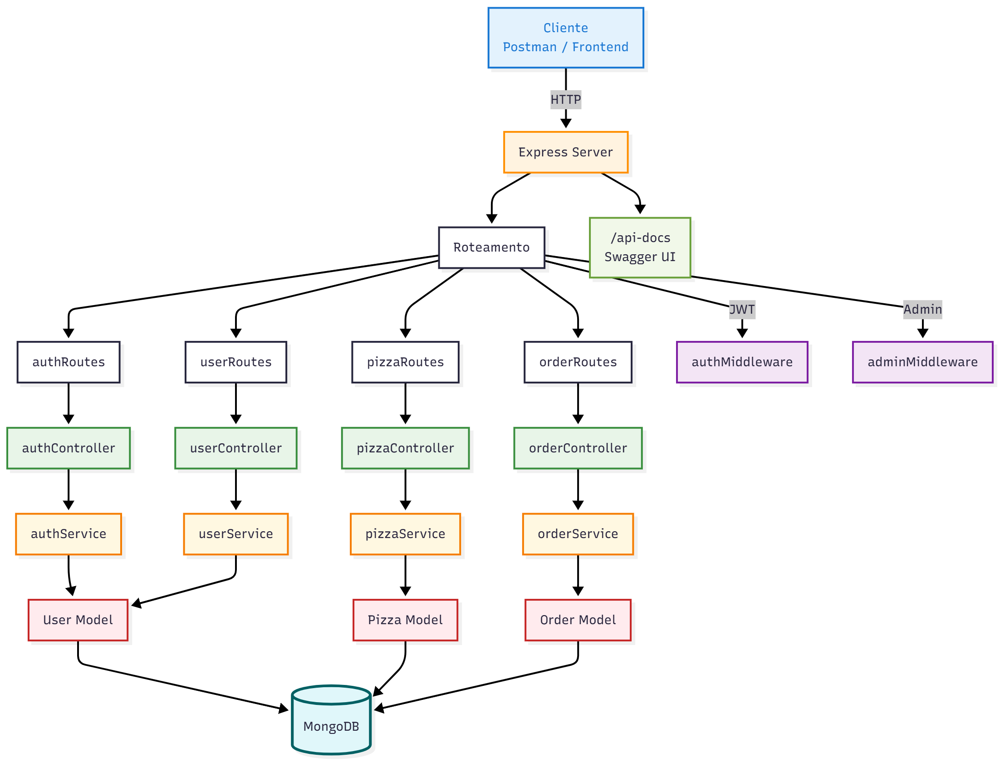
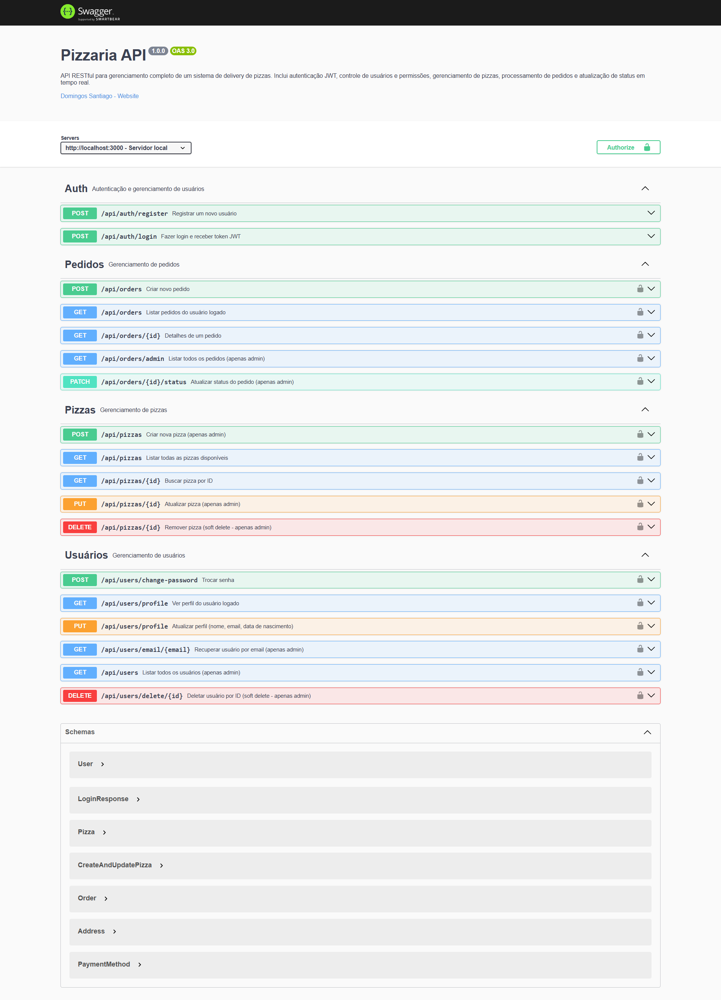

# Pizza Delivery API


**API RESTful para gerenciamento de um sistema de delivery de pizzas. Inclui autenticação JWT, controle de usuários e permissões, gerenciamento de pizzas, processamento de pedidos e atualização de status em tempo real.**  
Node.js • Express • MongoDB • Mongoose • JWT • Swagger

---

## FUNCIONALIDADES

- Cadastro e login com **JWT**
- Perfil do usuário (editar nome, e-mail, trocar senha)
- CRUD completo de **pizzas** (com soft delete)
- Criação de **pedidos** com:
  - Cálculo automático do total
  - Endereço completo
  - Método de pagamento
- Painel **admin**:
  - Listar todos os pedidos
  - Atualizar status (pendente → preparando → entregue)
- Documentação interativa com **Swagger**


## TECNOLOGIAS UTILIZADAS

| Camada | Tecnologia |
|-------|------------|
| Backend | Node.js + Express |
| Banco | MongoDB + Mongoose |
| Autenticação | JWT + bcrypt |
| Documentação | Swagger (OpenAPI 3.0) |
| Arquitetura | MVC + Service Layer |
| Segurança | Soft delete, hash de senhas, JWT |


## ESTRUTURA DO PROJETO



## ENDPOINTS DA API

| Método | Rota | Acesso | Descrição |
|--------|------|--------|---------|
| `POST` | `/api/auth/register` | Público | Cria um novo usuário (customer) |
| `POST` | `/api/auth/register` | Autenticado | Cria um novo usuário (admin) - apenas usuário admin |
| `POST` | `/api/auth/login` | Público | Autentica e retorna token JWT |
| `GET` | `/api/users/profile` | Autenticado | Retorna dados do usuário logado |
| `PUT` | `/api/users/profile` | Autenticado | Atualiza dados do usuário |
| `POST` | `/api/users/change-password` | Autenticado | Troca a senha do usuário |
| `GET` | `/api/users` | **Admin** | Lista todos os usuários |
| `GET` | `/api/pizzas` | Público | Lista todas as pizzas disponíveis |
| `GET` | `/api/pizzas/:id` | Público | Detalhes de uma pizza |
| `POST` | `/api/pizzas` | **Admin** | Cria uma nova pizza |
| `PUT` | `/api/pizzas/:id` | **Admin** | Atualiza uma pizza |
| `DELETE` | `/api/pizzas/:id` | **Admin** | Remove pizza (soft delete) |
| `POST` | `/api/orders` | Autenticado | Cria pedido com itens, endereço e pagamento |
| `GET` | `/api/orders` | Autenticado | Lista pedidos do usuário logado |
| `GET` | `/api/orders/:id` | Autenticado | Detalhes de um pedido do usuário |
| `GET` | `/api/orders/admin` | **Admin** | Lista **todos os pedidos** do sistema |
| `PATCH` | `/api/orders/:id/status` | **Admin** | Atualiza status do pedido (ex: `preparando`, `entregue`) |


## DEPENDÊNCIAS DO PROJETO

As principais dependências incluem:

- **Express** (v5) - Framework para Node.js.
- **Mongoose** (v8) - ODM para modelagem e interação com MongoDB.
- **bcrypt** (v6) - Para hash seguro de senhas com salt automático.
- **jsonwebtoken** (v9) - Geração e validação de tokens JWT para autenticação.
- **dotenv** (v17) - Carregamento de variáveis de ambiente a partir do `.env`.
- **cors** (v2.8) - Middleware para habilitação de requisições cross-origin (CORS).
- **swagger-jsdoc** (v6) + **swagger-ui-express** (v5) - Geração automática de documentação OpenAPI com interface interativa.
- **nodemon** (v3 - dev) - Reinício automático do servidor durante o desenvolvimento.


## COMO RODAR O PROJETO

### 1. Pré-requisitos
- Node.js (v16+)
- MongoDB (local ou Atlas)
- Postman (opcional)

### 2. Clone e instale
```bash
git clone https://github.com/dominuuus/api-node-mongoDB.git
cd pizza-delivery-api
npm install
```

### 3. Configure o `.env`
Siga a estrutura do arquivo `.env.example`

### 4. Gere uma chave segura com:
Requisito do `JWT_SECRET` no seu arquivo `.env`
```bash
node -e "console.log(require('crypto').randomBytes(64).toString('hex'))"
```

### 5. Inicie o servidor
```bash
npm run dev
```

## DOCUMENTAÇÃO INTERATIVA

Acesse a documentação completa e teste todos os endpoints **direto no navegador**:

[**Swagger UI - http://localhost:3000/api-docs**](http://localhost:3000/api-docs)




### DETALHES DA LICENÇA

- **Autor**: [Domingos Santiago]
- **Data**: 2025
- **Texto da Licença**:

  ```
  MIT License

  Copyright (c) 2025 [Domingos Santiago]

  Permission is hereby granted, free of charge, to any person obtaining a copy
  of this software and associated documentation files (the "Software"), to deal
  in the Software without restriction, including without limitation the rights
  to use, copy, modify, merge, publish, distribute, sublicense, and/or sell
  copies of the Software, and to permit persons to whom the Software is
  furnished to do so, subject to the following conditions:

  The above copyright notice and this permission notice shall be included in all
  copies or substantial portions of the Software.

  THE SOFTWARE IS PROVIDED "AS IS", WITHOUT WARRANTY OF ANY KIND, EXPRESS OR
  IMPLIED, INCLUDING BUT NOT LIMITED TO THE WARRANTIES OF MERCHANTABILITY,
  FITNESS FOR A PARTICULAR PURPOSE AND NONINFRINGEMENT. IN NO EVENT SHALL THE
  AUTHORS OR COPYRIGHT HOLDERS BE LIABLE FOR ANY CLAIM, DAMAGES OR OTHER
  LIABILITY, WHETHER IN AN ACTION OF CONTRACT, TORT OR OTHERWISE, ARISING FROM,
  OUT OF OR IN CONNECTION WITH THE SOFTWARE OR THE USE OR OTHER DEALINGS IN THE
  SOFTWARE.
  ```

---